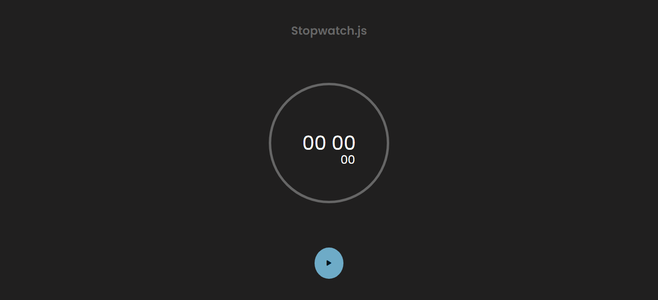
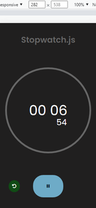

<h1 align='center'>Stopwatch ⏱</h1>

  <a href="#-sobre">Sobre</a>&nbsp;&nbsp;&nbsp;|&nbsp;&nbsp;&nbsp;
  <a href="#-prints">Prints</a>&nbsp;&nbsp;&nbsp;|&nbsp;&nbsp;&nbsp;
  <a href="#-tecnologias">Tecnologias</a>&nbsp;&nbsp;&nbsp;|&nbsp;&nbsp;&nbsp;
  <a href="#-funcionalidades">Funcionalidades</a>&nbsp;&nbsp;&nbsp;|&nbsp;&nbsp;&nbsp;
  <a href="#-possíveis-melhorias">Possíveis Melhorias</a>&nbsp;&nbsp;&nbsp;|&nbsp;&nbsp;&nbsp;
  <a href="#-licença">Licença</a>&nbsp;&nbsp;&nbsp;|&nbsp;&nbsp;&nbsp;

## 💻 Sobre

Este projeto é um cronômetro feito em HTML, CSS e JavaScript puro ou vanilla. 

Clique [aqui](https://codepen.io/gustavo_victor/pen/qBMmaJo) para conferir como o projeto ficou no Codepen.

## 📷 Prints

 

## 🛠 Tecnologias

- Linguagens: 
    - [HTML](https://developer.mozilla.org/pt-BR/docs/Web/HTML) 
    - [CSS](https://developer.mozilla.org/pt-BR/docs/Web/CSS)
    - [JavaScript](https://www.javascript.com/)
- Ferramentas / Recursos: 
    - Editor: [Visual Studio Code](https://code.visualstudio.com/)
    - Fontes: [Poppins](https://fonts.google.com/specimen/Poppins?query=Poppins)
    - Ícones: [Fontawesome](https://fontawesome.com/)

## ⚙ Funcionalidades 

- [x] Iniciar o cronômetro 
- [x] Pausar o cronômetro 
- [x] Voltar a executar o cronômetro 
- [x] Resetar o tempo do cronômetro 
- [x] Mostrar o tempo do cronômetro na tela 

## 👌 Possíveis melhorias

- [ ] Marcar recordes de tempo no cronômetro. É uma possível funcionalidade de melhoria...

## 📝 Licença 

O projeto está sob a [Licensa MIT](./LICENSE) 

Qualquer pessoa pode usar, clonar e contribuir com este projeto. 

